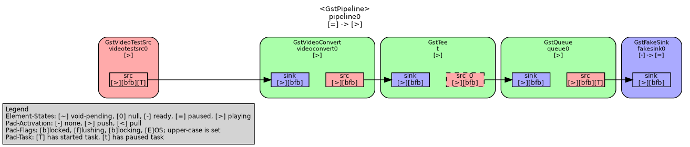
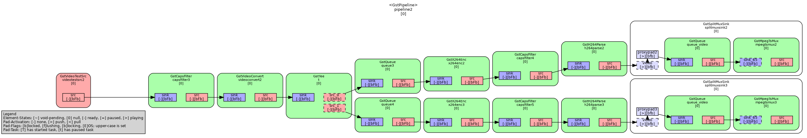

# GStreamer concepts and examples

-----------------

## multipipe

Analyse the memory usage of various ways to start/stop a pipeline.

Context: Two pipelines are running at the same time
(which is ok for gstreamer)

One pipeline is constantly running, started on a separate thread:


The second pipeline:


* The second pipeline is started/stopped via set state constantly (multipipe -s)
* The second pipeline is created/started/stopped/destroyed via set state and gst_object_unref constantly (multipipe -c)
* The second pipeline is running constantly (multipipe -r)

```/bin/bash
> ./multipipe -h
[main.cpp][main][97] Application started
Analyze memory consumption of gstreamer start/stop pipes
Usage:
  multipipe [OPTION...]

  -s, --start     starting and stopping
  -c, --creating  starting and stopping by destroying and creating 
                  pipelines
  -r, --running   constantly running pipelines
  -h, --help      Print usage

use GST_DEBUG_DUMP_DOT_DIR=. to export the pipeline structure.
 and dot -Tpng filename.dot -o outfile.png

```

### Results

```/bin/bash
[main.cpp][main][97] Application started
[main.cpp][main][146] Starting/Stopping with destroying the pipeline
[main.cpp][check_mem_usage][27] [Started] RSS: 305272kB   | SM: 16184kB   | PM: 289088kB  | Max: 289088kB
[main.cpp][check_mem_usage][27] [Stopped] RSS: 31416kB    | SM: 16376kB   | PM: 15040kB   | Max: 289088kB
[main.cpp][check_mem_usage][27] [Started] RSS: 298276kB   | SM: 16376kB   | PM: 281900kB  | Max: 289088kB
[main.cpp][check_mem_usage][27] [Stopped] RSS: 56864kB    | SM: 16376kB   | PM: 40488kB   | Max: 289088kB
[main.cpp][check_mem_usage][27] [Started] RSS: 311392kB   | SM: 16376kB   | PM: 295016kB  | Max: 295016kB
[main.cpp][check_mem_usage][27] [Stopped] RSS: 74272kB    | SM: 16376kB   | PM: 57896kB   | Max: 295016kB
[main.cpp][check_mem_usage][27] [Started] RSS: 315392kB   | SM: 16376kB   | PM: 299016kB  | Max: 299016kB
[main.cpp][check_mem_usage][27] [Stopped] RSS: 81208kB    | SM: 16376kB   | PM: 64832kB   | Max: 299016kB
```

There is a memory leak when one pipeline is stopped and then freed (via gst_object_unref). The expectation was that the
memory is freed completely after the gst_object_unref. Looks like the memory is still held in the mainloop.

-----------------

## pipeline-interception

A simple appsrc/appsink example.